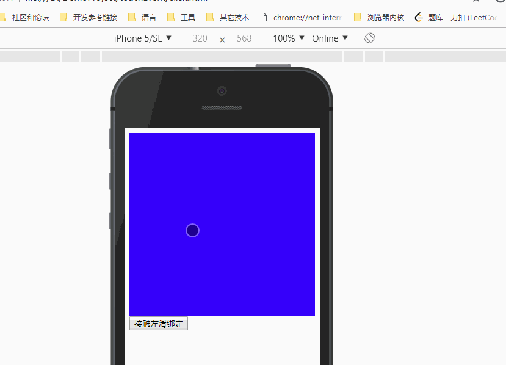

## 原生js实现移动端点击、长按、左滑、右滑、上滑、下滑等事件模拟
为什么要模拟这些事件？ 
1、上述这些事件中，浏览器直接支持的事件只有点击，而其它事件使用频率也很高。 

2、移动端web原生点击事件会有300ms的延迟，因为用户肯能双击，为了判断用户是单击还是双击，所以会有这个延迟，这个延迟会衍生很多问题，例如点击穿透。所以我们可以不用原生的点击事件，而使用模拟点击事件。 

如何模拟这些事件呢？ 
我们可以总结这些操作，都是手指先触摸屏幕，然后在离开。不同点在于滑动事件手指有位移，而点击事件手指没有位移。 
首先想到的就是所有浏览器都是支持touchstart、touchmove和touchend事件的，我们可以利用这些事件来模拟上述事件。 

原理如下： 
1、监听dom的touchstart和touchend事件。 
2、分别记录touchstart、touchend事件的位置和时间，计算位移delta（包括x和y）和时间间隔timegap。 
3、根据delta和timegap的值，判断属于哪种事件。有两种情况： 
- delta中x和y都很小 
这是点击操作，用户点击按钮等时，理论上是不会有位移的，但是实际中也可能发生一个很小的位移，毕竟手指不是精密仪器。 
如果时间间隔timegap较小，则属于点击，如果timegap较大，属于长按操作。 
- delta中的x或y比较大 
这种情况下，就是手指发生滑动操作了，至于是左右滑动，还是上下滑动，根据x和y的大小来判断。 
|x| > |y|（|x|代表x的绝对值），左右滑动，x>0,右滑，反之左滑。 
|x| <= |y|，上下滑动，y>0,下滑，反之上滑。 

代码在EventUtil.js中。 

在闭包中定义了几个事件处理操作，EventUtil有两个方法，bindEvent绑定事件，removeEvent是移除事件绑定。 
支持六个事件： 
swipeleft是左滑事件，swiperight是右滑事件，slideup是上滑事件，slidedown下滑事件，click点击事件，longpress长按点击事件。 

使用案例如下： 
测试代码在click.html中,代码中有注释，可以看到如何应用这些模拟事件：
测试效果如下:
 
有疑问的可以留言或发送邮件至472784995@qq.com。
